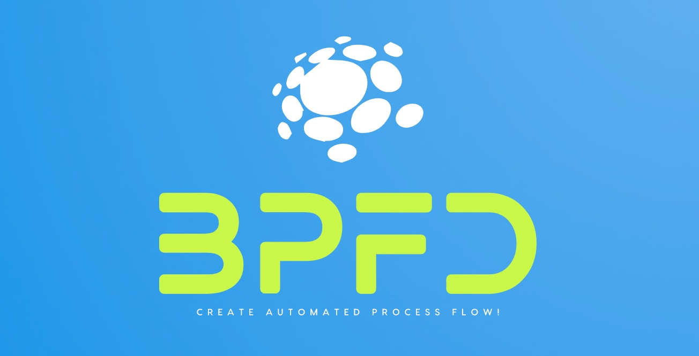

# Building Process Flow diagram based on Python-based LLMs



## About this package

This new solution will to evaluate and enhance Generative AI applications by using Matplotlib, OpenAI & Python. It offers the capability to generate any process flow diagram based on the input prompt with the help of Matplotlib. This project is for the advanced Python & React developer, Gen AI & data Science Newbie.


## How to use this package

(The following instructions apply to Posix/bash. Windows users should check
[here](https://docs.python.org/3/library/venv.html).)

First, clone this repository and open a terminal inside the root folder.


Install the requirements:

```bash
pip install -r requirements.txt
```

Install the above requirements.

Create and activate a new virtual environment (recommended) for consumer application by running
the following:

```bash
python3 -m venv senv
source senv/bin/activate
```

Run the server, which will interact with Open AI & UpTrain server by invoking the specific APIs.

```bash
python generateFlowDiagram.py
```

Please find the some of the important dependent package -

```

pip install matplotlib==3.9.1
pip install networkx==3.3
pip install numpy==2.0.0
pip install openai==1.35.13
pip install pandas==2.2.2
pip install pillow==10.4.0


```

## Screenshots


## Resources

- To view the complete demo with sound, check out our [YouTube Page](https://youtu.be/7VQSncDoeeU).
- To view on Python, check out the [Python Page](https://docs.python.org/3/).
- To view more on the OpenAI, check out this [UpTrain Official Page](https://platform.openai.com/docs/overview).
- To view more on the Matplotlib, check out this [React Official Page](https://matplotlib.org/stable/index.html).
